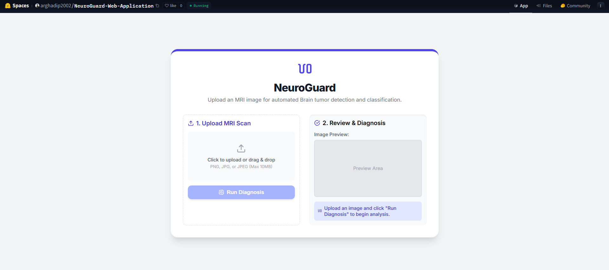
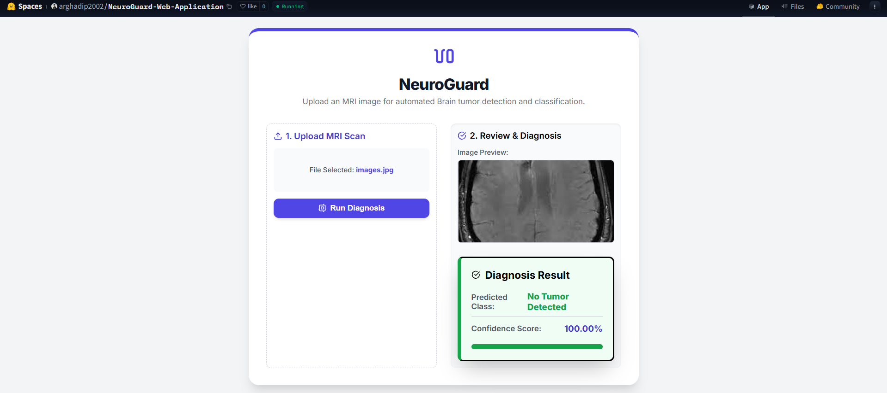
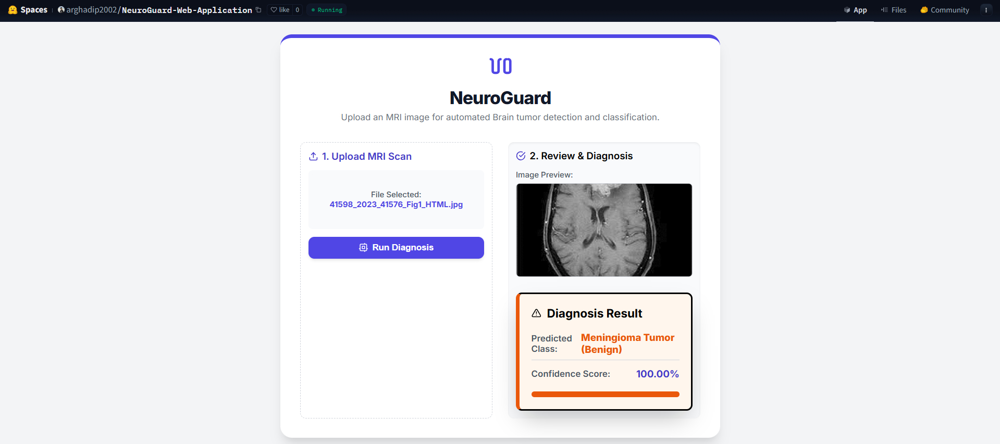

<!-- 
---
title: NeuroGuard Web Application
emoji: 🧠
colorFrom: blue
colorTo: purple
sdk: docker
app_port: 7860
pinned: false
---
-->

# 🧠 NeuroGuard Web Application  
### Automated MRI Brain Tumor Detection System (HuggingFace Deployment Guide)

---

## 🌟 Introduction

The **NeuroGuard Web Application** is a **state-of-the-art Deep Learning system** built for automated, highly accurate classification of brain tumors from **Magnetic Resonance Imaging (MRI) scans**.

It uses a custom **ResidualInceptionBlock Convolutional Neural Network (CNN)** with over **50 layers**, delivering real-time 4-class predictions:

- **Glioma**
- **Meningioma**
- **Pituitary**
- **No Tumor**

This repository contains the **full-stack implementation** using:

- **FastAPI (Backend + PyTorch Inference)**
- **React + Vite (Frontend)**
- **Docker + Docker Compose (Deployment)**

It is optimized so that **any user can deploy the full software directly on HuggingFace Spaces**, without using their local machine.

---

## 🖼️ Application UI






---

# 🚀 Deployment Instructions (HuggingFace Spaces)

This guide allows any user to deploy the full application **inside HuggingFace Spaces** using Docker — identical to running it on a production server.

---

## ⚠️ IMPORTANT — Before Deployment

### ✔ 1. Clone the Repository **from GitHub**

```bash
git clone https://github.com/arghadip2002/NeuroGuard-Web-Application
cd NeuroGuard-Web-Application
```

---

### ✔ 2. Download the Model File

The file `backend/models/model.pth` is intentionally empty in the repository.

You must download the **trained model** from the Google Drive link:

```
<YOUR_GOOGLE_DRIVE_LINK_HERE>
```

Rename it to:

```
model_Full.pth
```

Then place it inside:

```
backend/models/
```

Final path:

```
backend/models/model_Full.pth
```

---

### ✔ 3. Comment in the YAML Header at the Top

Before pushing to HuggingFace, **comment in** the following block:

```markdown
<!--
---
title: ...
---
-->
```

It should look like this:

```yaml
---
title: NeuroGuard Web Application
emoji: 🧠
colorFrom: blue
colorTo: purple
sdk: docker
app_port: 7860
pinned: false
---
```

These lines are required in HuggingFace.

---

#### ✔ 3.1 IMPORTANT: Delete Visualisation Folder & Reinitialize Git (NEW)

Before step 4 (pushing to your Space) you must remove the Visualisation folder (it contains local UI screenshots and is not required on the HuggingFace Space build), and then remove the repository history and reinitialize git to ensure a clean push to your new HuggingFace Space.

From the project root:

```
# delete the Visualisation folder
rm .\Visualisation\

# remove existing git history (hidden .git folder) manually

# reinitialize a fresh git repo
git init

# add all files and commit with the required message
git add .
git commit -m "all task completed as per instructions from the dev @arghadip2002"
```
Note: Removing .git and reinitializing gives you a clean commit history for the Space push. Make sure you have any remote backups you need before removing .git.

## ✔ 4. Push to Your New HuggingFace Space

```bash
git remote add space https://huggingface.co/spaces/<your-username>/<your-space>
git push --force space main
```

HuggingFace will automatically:

- Build the Docker container  
- Start the backend  
- Serve the frontend  
- Host the complete web application  

Your app will be live at:

```
https://<your-username>-<your-space>.hf.space
```

---

# 🛠️ Technology Stack

| Component          | Technology     | Version   |
|--------------------|---------------|-----------|
| Deep Learning      | PyTorch       | 2.1.0     |
| Backend API        | FastAPI       | 0.104.1   |
| Frontend           | React         | 18.2.0    |
| Build Tool         | Vite          | 5.0.0     |
| Containerization   | Docker        | Latest    |
| Hosting Platform   | HuggingFace Spaces | Latest |

---

# 👨‍💻 Developer & Credits

- **Developer**: [Arghadip Biswas](https://github.com/arghadip2002)
- **Dataset Links**: https://github.com/arghadip2002/SAETCN-and-SASNET-Architectures/blob/main/dataLinks
- **Inspired By**: [SAETCN Architecture](https://github.com/arghadip2002/SAETCN-and-SASNET-Architectures)

---

# ⭐ Notes

- The project is fully functional once the correct model file is added.  
- Users deploying this on HuggingFace must **clone from GitHub**, not from the Space itself.  
- HuggingFace spaces rebuild automatically on every push.  

---

